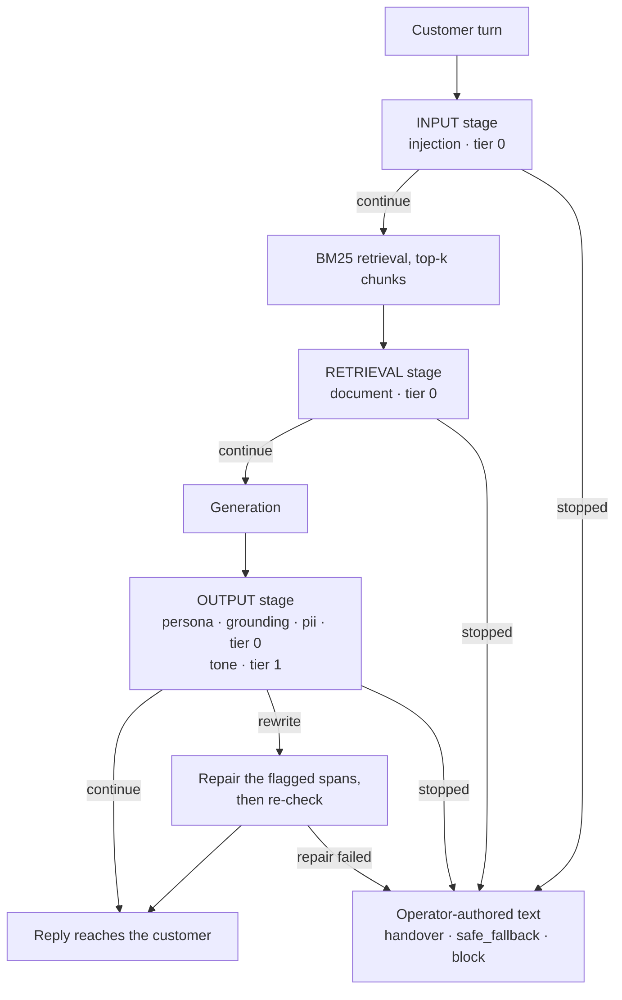

# Guardrails Challenge

A guardrail layer for a multilingual, multi-turn telecom customer-service
assistant. The CLI runs the full `INPUT → RETRIEVAL → OUTPUT` pipeline, executes
its action, and writes a compact JSONL trace for each turn.

## How a turn flows



A stage that does not return `continue` ends the turn there. INPUT and
RETRIEVAL run **before** the model is called, so a stopped turn costs no
generation. [DESIGN.md](DESIGN.md#3-architecture) has the full diagram and the
verdict-to-action split.

## What is implemented

| Guard | Stage | Tier | Detects |
|---|---|---:|---|
| `injection` | INPUT | 0 | Instruction override, role reassignment, encoded payloads and cross-turn assembly |
| `document` | RETRIEVAL | 0 | Indirect instructions embedded in retrieved documents |
| `persona` | OUTPUT | 0 | Address form, emoji, forbidden phrases, sentence length and TTS hazards |
| `grounding` | OUTPUT | 0 | Unsupported numbers, prices, dates, durations and commitments |
| `pii` | OUTPUT | 0 | Personal data in the reply that did not originate in the customer turn |
| `tone` | OUTPUT | 1 | Residual brand-tone dimensions via forced tool choice |

Profiles select locale, persona, routing, failure policy, model identifiers,
latency budget and tier cap. Voice is limited to deterministic tier 0; chat can
run the measured tier-1 judge.

## Setup

```bash
python3 -m venv .venv
./.venv/bin/pip install -r requirements.txt
```

The default test suite is entirely local. Live tests and the CLI read
`ANTHROPIC_API_KEY` and optional `ANTHROPIC_BASE_URL` from the environment. No
recorded-response or offline provider is included.

```bash
PYTHONPATH=src:tests ./.venv/bin/python -m pytest -q
```

## Usage

```bash
export ANTHROPIC_API_KEY=...          # required for live calls
export ANTHROPIC_BASE_URL=...         # optional relay

PYTHONPATH=src ./.venv/bin/python -m chatbot \
  --profile telco_de \
  --question "Was kostet Tarif M?"
```

Omit `--question` for the REPL. Use `--profile telco_en` for the English
channel or `--mode voice` for the tier-0 voice policy. `--no-guards` runs the
same retrieval and generation path without guard execution, for direct
before/after evidence. Each CLI run writes `runs/<run_id>.jsonl`.

## Evidence and design

- [DESIGN.md](DESIGN.md) explains architecture, trade-offs and measured limits.
- [tests/test_results.md](tests/test_results.md) records test distribution,
  scenario results, recall and latency.
- [docs/evaluation.md](docs/evaluation.md) answers the reflection questions.
- [examples/example_runs.md](examples/example_runs.md) contains real live
  transcripts, including three with/without-guards pairs.

## Repository layout

| Path | Contents |
|---|---|
| `src/chatbot.py` | Turn orchestration, action execution, CLI and trace summaries |
| `src/guardrails/guards/` | Six registered guards and their shared interface |
| `src/guardrails/provider/` | Plain-text and forced-tool completion protocols plus the live provider |
| `src/guardrails/retrieval/` | Chunking, document loading, BM25 and locale-partitioned knowledge base |
| `src/guardrails/locale/` | German and English tokenisation, grammar and entity rules |
| `profiles/` | Telecom and health-insurance client profiles |
| `kb/` | German and English knowledge-base documents |
| `tests/` | Unit, scenario, recall, live and recorded-result documentation |
| `examples/` | Live transcripts and before/after evidence |
| `docs/` | Evaluation and reflection |
